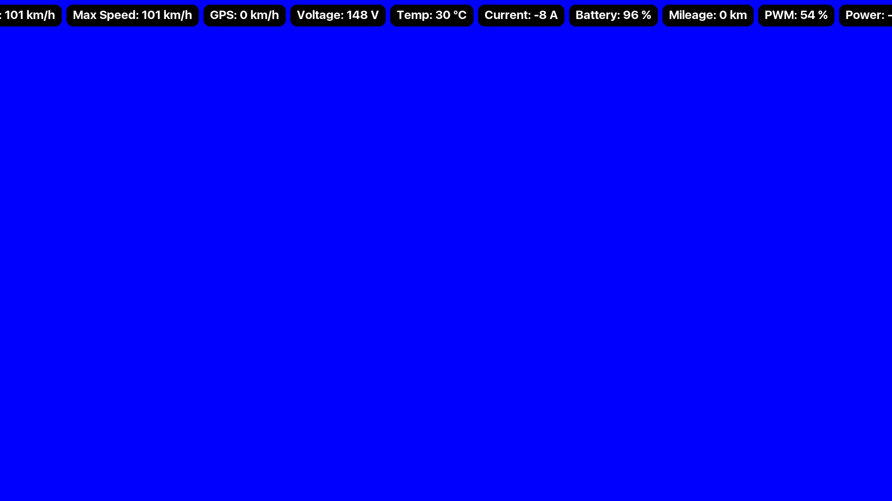

# EUC Data Visualizer

A powerful Flask web application that transforms Electric Unicycle (EUC) sensor data into dynamic, visually engaging video visualizations. Built with advanced processing capabilities and comprehensive cross-platform support.



## Features

- 🎥 Dynamic video generation from EUC sensor data
- 📊 Advanced data processing and visualization
- 🌐 Cross-platform compatibility
- 🎨 Custom font integration (SF UI Display)
- 📱 Responsive web interface
- 🔄 Asynchronous processing
- 📦 Comprehensive data handling
- 🎬 FFmpeg integration for high-quality video output
- 🖼️ Advanced image manipulation with Pillow
- 📈 Pandas-powered data analysis

## Requirements

- Python 3.x
- FFmpeg
- PostgreSQL database
- Modern web browser

## Installation

1. Clone the repository:
```bash
git clone https://github.com/yourusername/euc-data-visualizer.git
cd euc-data-visualizer
```

2. Install Python dependencies:
```bash
pip install -r requirements.txt
```

3. Set up environment variables:
```bash
FLASK_SECRET_KEY=your_secret_key
DATABASE_URL=your_database_url
```

4. Initialize the database:
```bash
flask db upgrade
```

## Usage

1. Start the Flask server:
```bash
python main.py
```

2. Access the web interface at `http://localhost:5000`

3. Upload your EUC sensor data (CSV format)

4. Configure visualization parameters:
   - Resolution
   - FPS
   - Font size
   - Padding and spacing
   - Border radius

5. Generate preview and final video

## Project Structure

```
├── app.py              # Flask application setup
├── main.py            # Application entry point
├── models.py          # Database models
├── utils/             # Utility functions
│   ├── background_processor.py
│   ├── csv_processor.py
│   ├── image_generator.py
│   └── video_creator.py
├── static/           # Static assets
├── templates/        # HTML templates
├── fonts/           # Custom fonts
└── frames/          # Generated frame storage
```

## Configuration

### Video Settings
- Resolution: FHD (1920x1080)
- Codec: H.264
- FPS: Configurable (default: 14.985)

### Visual Customization
- Font: SF UI Display (multiple weights)
- Vertical position adjustment
- Customizable padding and spacing
- Adjustable font size
- Configurable border radius

## Development

### Running in Debug Mode
```bash
python main.py
```

### Processing Workflow
1. CSV data upload and validation
2. Data processing and normalization
3. Frame generation with custom styling
4. Video compilation with FFmpeg
5. Preview generation

## Contributing

1. Fork the repository
2. Create a feature branch
3. Commit your changes
4. Push to the branch
5. Create a Pull Request

## License

This project is licensed under the MIT License - see the [LICENSE](LICENSE) file for details.

## Acknowledgments

- FFmpeg for video processing
- Pandas for data handling
- Pillow for image manipulation
- Flask community for the web framework
- SF UI Display font by Apple Inc.

## Support

For questions and support, please open an issue in the GitHub repository.
